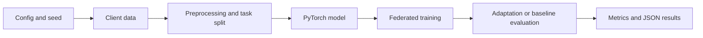

# FedMetaBench

**FedMetaBench is a PyTorch benchmark suite for testing federated personalization under noisy labels, group imbalance, new sensing locations, and temporal concept drift.** It contains four independent, CPU-runnable demonstrations that compare MAML-style adaptation with federated averaging baselines on synthetic data, with optional clinical and air-quality datasets.

The project demonstrates experiment design, PyTorch modeling, federated client simulation, reproducible YAML configuration, fairness and drift evaluation, and lightweight research-code validation. A clean checkout does not require private data or a committed model checkpoint.

## Problem and Motivation

Federated clients cannot pool raw data, but they also do not share the same data distribution. A hospital may have different group proportions, a sensor may be newly deployed, labels may be noisier at one site, and the target distribution may change over time. FedMetaBench makes those shifts explicit so personalization methods can be compared with simple baselines under controlled conditions.

## Benchmarks

| Benchmark | Research question | Main methods | Default data |
| --- | --- | --- | --- |
| [FedNoisyMAML](benchmarks/FedNoisyMAML) | Does adaptation remain useful when label noise differs by client? | FedMAML, FedAvg | Synthetic Gaussian mixture |
| [FairFedMeta](benchmarks/FairFedMeta) | Can federated training reduce worst-group performance gaps? | FairFedMAML, FairFedAvg, AgnosticFairFL, FedAvg, Per-FedAvg | Synthetic clinical sequences |
| [FedMetaEnv](benchmarks/FedMetaEnv) | How well does a model cold-start on a held-out station? | FedEnvMAML, FedAvg, LocalOnly | Synthetic multi-station streams |
| [FedMetaTemporal](benchmarks/FedMetaTemporal) | How do methods respond to temporal concept drift? | TemporalFedAvg, TemporalMAML, EWCMAML | Synthetic drifting streams |

Optional inputs are documented in each benchmark README: MNIST/CIFAR-10, processed eICU data, and Beijing PRSA air-quality CSVs. No empirical score is claimed here; run the supplied configs to generate local JSON results.

## Architecture and Workflow

Each benchmark is intentionally standalone: `run_experiment.py` loads YAML, creates or loads client data, trains the configured algorithm, evaluates benchmark-specific client, station, or task data, and writes JSON under `results/`.



The common experimental path is:

```text
Data -> client/task construction -> model -> federated training -> evaluation -> results JSON
```

## Technologies

- Python 3.10+ and PyTorch 2.0+
- NumPy, SciPy, pandas, scikit-learn, PyYAML, and tqdm
- YAML-driven experiments with deterministic seeds
- Optional `torchvision` for image datasets and `h5py` for processed eICU input
- Bash and PowerShell smoke runners for Linux/macOS and Windows workflows

## Project Structure

```text
FedMetaBench/
├── README.md
├── requirements.txt
├── benchmarks/
│   ├── FedNoisyMAML/
│   ├── FairFedMeta/
│   ├── FedMetaEnv/
│   └── FedMetaTemporal/
├── docs/SCOPE.md
└── scripts/
	├── run_smoke_all.sh
	└── run_smoke_all.ps1
```

Every benchmark contains a runner, `src/` implementation, `configs/`, tests, and a focused README.

## Installation and Setup

Use a fresh virtual environment and a Python version supported by the installed PyTorch wheel. The root requirements pin the core versions used by the smoke configurations. Benchmark-specific requirement files inherit those pins and add only optional dataset or plotting extensions.

```bash
git clone https://github.com/SulemanQB/FedMetaBench.git
cd FedMetaBench
python -m venv .venv
source .venv/bin/activate                 # Windows: .venv\Scripts\Activate.ps1
python -m pip install --upgrade pip
python -m pip install -r requirements.txt
```

The smoke configs explicitly use CPU. A GPU is optional for longer experiments; verify that the PyTorch wheel matches the selected Python version and platform.

## Demonstration

Run all four short experiments from the repository root:

```bash
bash scripts/run_smoke_all.sh
```

On Windows PowerShell:

```powershell
./scripts/run_smoke_all.ps1
```

The successful final line is:

```text
[FedMetaBench] All smoke runs completed.
```

Each run writes a gitignored JSON artifact to `benchmarks/<benchmark>/results/`. To run one benchmark, use its package directory, for example:

```bash
cd benchmarks/FedMetaTemporal
python run_experiment.py --config configs/smoke.yaml
```

For a longer run, replace `smoke.yaml` with `default.yaml`. The configs are the source of truth for rounds, clients, model sizes, seeds, evaluation frequency, and output directories. FairFedMeta also accepts dot-notation overrides such as `algorithm.name=fedavg`.

## Results and Evaluation

Results are generated locally and are not committed. The benchmarks report task-specific metrics including accuracy, worst-group accuracy and fairness gaps, regression MSE/MAE/RMSE, adaptation improvement, temporal accuracy, and drift summaries. Because runtime and hardware affect these experiments, this repository does not fabricate a leaderboard or hard-code results that have not been reproduced from the current checkout.

## Data and Reproducibility

- Synthetic data is the default and contains no PHI.
- Every experiment exposes a seed in its YAML config.
- Optional datasets must be downloaded separately and are ignored by Git.
- FedMetaEnv searches configured relative data directories; an external directory can be supplied with `FEDMETAENV_DATA_DIR`.
- FedNoisyMAML image data uses `DATA_ROOT` when `mnist` or `cifar10` is selected.
- Real eICU input requires the optional package and the file layout documented in [FairFedMeta](benchmarks/FairFedMeta/README.md).

## Limitations

These are research demonstrations, not production federated-learning infrastructure. Synthetic distributions are useful for controlled comparisons but do not establish clinical, environmental, or deployment performance. Real datasets, stronger baselines, confidence intervals, and independent replications are still needed for research claims. Training the default configurations can be substantially slower than the smoke configs.

## Technical Highlights

- Four isolated benchmark workflows around distinct federated distribution shifts.
- Configurable PyTorch models, client/task construction, adaptation loops, baselines, and task-specific metrics.
- Deterministic smoke configurations and cross-platform orchestration scripts.
- Optional sensitive or large inputs stay outside the repository, with documented configuration boundaries.
- JSON result artifacts can be inspected or compared without rerunning the training loop.

## Troubleshooting

| Symptom | Action |
| --- | --- |
| `torch` fails to import with a native DLL or shared-library error | Install a PyTorch wheel compatible with your Python version and OS in a clean virtual environment. |
| A real dataset is not found | Check the benchmark README and pass a portable relative directory or documented environment variable. Synthetic fallback is expected when optional data is absent. |
| A run is too slow | Start with `configs/smoke.yaml`, reduce rounds or clients in a copied config, and keep the seed fixed. |
| CUDA is unavailable | Use the CPU smoke configs or set the experiment device to `cpu`; no GPU is required for the demonstration path. |

## What the code shows

1. Start with the benchmark table and explain why federated clients need personalization.
2. Open one package README and its `configs/smoke.yaml` to show the experiment contract.
3. Run the repository smoke script from the root, using Bash or PowerShell for your platform.
4. Open a generated JSON result and connect its metrics to the benchmark question.
5. Walk through the runner: config, client data, model, training algorithm, evaluation, and artifact writing.
6. Explain the engineering decision to default to synthetic data and keep real datasets optional and uncommitted.
7. Discuss limitations, especially synthetic-data validity, runtime, and the need for broader baselines and repeated real-data evaluation.

## Project Scope and License

[docs/SCOPE.md](docs/SCOPE.md) records which research tracks belong in this repository and which remain separate. The project is released under the MIT License; see [LICENSE](LICENSE).
